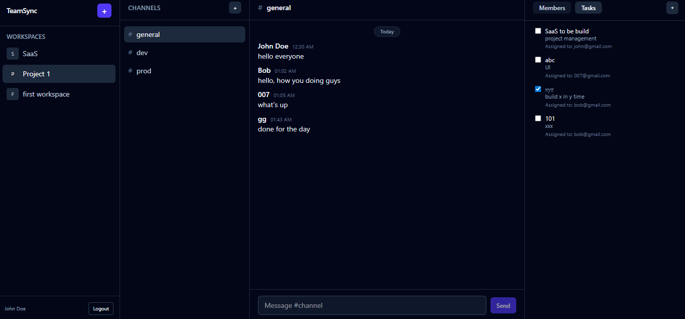
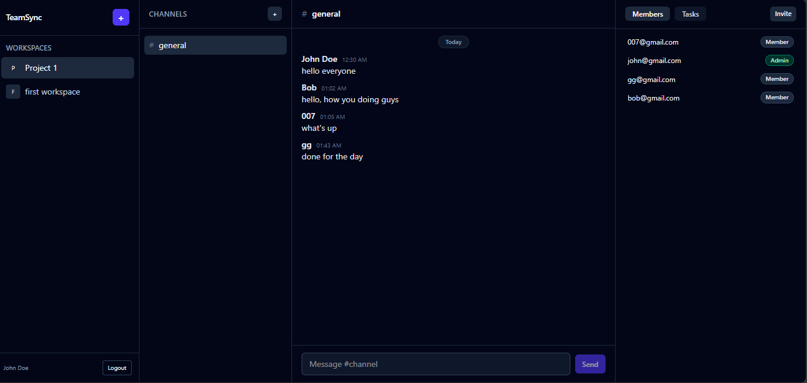

<div align="center">

# 🔗 TeamSync

**Real-Time Project Collaboration Hub**

TeamSync is a full-stack team workspace that bridges the gap between task management and instant messaging — ensuring project updates and team discussions happen in one unified interface, with zero-latency real-time sync powered by Firebase.

[](https://teamsync-gamma.vercel.app/)
[](https://teamsync-gamma.vercel.app/)
[](https://render.com)
[](https://vitejs.dev/)
[](https://firebase.google.com/)

</div>

---

## 📌 Overview

Modern teams shouldn't have to jump between five different tools to get work done. TeamSync brings **real-time chat**, **task assignment**, and **member management** into a single dark-themed workspace designed for long collaborative sessions.

Built on a hybrid Firebase architecture — the **Client SDK** powers live Firestore listeners on the frontend for instant message delivery, while the **Admin SDK** handles all secure server-side operations on the backend. The result is a fast, consistent experience across every connected client with no page refreshes needed.

---

## 📸 Screenshots

### 💬 Real-Time Chat + Task Panel


### 👥 Member Directory


---

## ✨ Features

### 🔐 Authentication
A custom signup and login flow lets users register with a display name that carries across all workspace activity — messages, task assignments, and member lists all reflect the correct identity. Only authenticated users can access any workspace.

### 🏢 Multiple Workspaces
Users can create and switch between multiple independent workspaces from the left sidebar. Each workspace has its own channels, members, tasks, and roles — completely isolated from other workspaces.

### 💬 Real-Time Messaging
Messages appear instantly across all connected clients the moment they are sent — powered by Firestore `onSnapshot` listeners with no polling or refresh required. Channels like `#general`, `#dev`, and `#prod` keep conversations organized by topic within each workspace.

### ✅ Task Management
Any workspace member can create tasks and assign them to specific members by email. Each task shows a title, description, and the assigned member. A checkbox lets any member mark a task as complete — finished tasks are visually distinguished from active ones at a glance.

### 👥 Member Directory with Role-Based Access
The Members tab lists every person in the workspace alongside their role — **Admin** or **Member**. Only Admins can invite new people via the Invite button. Members have full access to chat and tasks but cannot manage who joins the workspace.

### 📱 Responsive Design
A collapsible sidebar and mobile-first layout ensures TeamSync works cleanly across desktop and mobile screens without breaking the chat or task experience.

---

## 🛠️ Tech Stack

### Frontend
| Technology | Purpose |
|---|---|
| React.js (Vite) | High-performance component-based UI |
| Tailwind CSS | Fully responsive dark-themed interface |
| Axios | Custom instance for backend API communication |
| Firebase Client SDK | Real-time `onSnapshot` listeners for instant messaging |

### Backend
| Technology | Purpose |
|---|---|
| Node.js + Express | Scalable REST API architecture |
| Firebase Admin SDK | Secure server-side user and database management |
| Firestore | NoSQL document database for real-time data persistence |
| CORS + Middleware | Production-ready API protection |

---

## 📁 Project Structure

```
teamsync/
│
├── assets/                  # Screenshots for README
│   ├── task.PNG
│   └── chat.PNG
│
├── frontend/                # React + Vite client
│   ├── src/
│   │   ├── components/
│   │   ├── pages/
│   │   └── main.jsx
│   ├── .env                 # VITE_API_URL + Firebase config
│   ├── index.html
│   └── package.json
│
└── backend/                 # Node.js + Express server
    ├── routes/
    ├── middleware/
    ├── .env                 # Firebase Admin credentials
    └── package.json
```

---

## ⚙️ Local Setup

### Prerequisites
- Node.js v18+
- A Firebase project with Firestore enabled
- Firebase Admin SDK service account credentials

### 1. Clone the repository
```bash
git clone https://github.com/Rashed-AlAmin/teamsync.git
cd teamsync
```

### 2. Set up the Backend
```bash
cd backend
npm install
```

Create a `.env` file inside `/backend`:
```env
PORT=5000
FIREBASE_PROJECT_ID=your_project_id
FIREBASE_CLIENT_EMAIL=your_client_email
FIREBASE_PRIVATE_KEY="your_private_key"
```

Run the backend server:
```bash
npm start
```

### 3. Set up the Frontend
```bash
cd ../frontend
npm install
```

Create a `.env` file inside `/frontend`:
```env
VITE_API_URL=http://localhost:5000
VITE_FIREBASE_API_KEY=your_api_key
VITE_FIREBASE_AUTH_DOMAIN=your_auth_domain
VITE_FIREBASE_PROJECT_ID=your_project_id
VITE_FIREBASE_APP_ID=your_app_id
```

Run the frontend:
```bash
npm run dev
```

App runs at `http://localhost:5173`

> ⚠️ Never commit your `.env` files. Add them to `.gitignore`.

---

## 🗺️ Roadmap

### 🔜 In Progress / Coming Next

- [ ] **Google OAuth** — One-click signup and login via Google, removing the manual registration step entirely and speeding up onboarding
- [ ] **File Sharing** — Upload and share images, videos, and documents directly inside chat channels so teams never need to leave the workspace to share context
- [ ] **Dynamic Task Management** — Priority levels (Low / Medium / High), due dates, filtering by assignee or status, and a task detail view for richer context per task

### 🔭 Further Down the Line

- [ ] **Direct Messaging** — Private 1-on-1 conversations between members outside of workspace channels
- [ ] **Thread Replies** — Nested reply chains on messages to keep side conversations from cluttering the main channel
- [ ] **Task Comments** — Leave notes and updates directly on a task so the full discussion lives alongside the work
- [ ] **Notifications** — In-app alerts for task assignments, mentions, and direct messages so nothing slips through
- [ ] **Search** — Full-text search across messages and tasks within a workspace
- [ ] **Activity Feed** — A timeline of recent workspace events visible to all members: task completions, new invites, file uploads
- [ ] **Channel Management** — Let Admins create, rename, and archive channels directly from the UI

---

## 🎨 Design Philosophy

TeamSync follows a **Slate/Indigo** aesthetic — dark backgrounds with high-contrast indigo and white elements built to stay readable during long working sessions. The collapsible sidebar keeps navigation out of the way when not needed, and the tabbed Members/Tasks panel means every key view is one click away from the chat without taking up permanent screen space.

---

## 🤝 Contributing

Pull requests are welcome. For major changes, please open an issue first to discuss what you'd like to change.

1. Fork the repository
2. Create your feature branch: `git checkout -b feature/your-feature`
3. Commit your changes: `git commit -m "Add your feature"`
4. Push to the branch: `git push origin feature/your-feature`
5. Open a Pull Request

---

<div align="center">

Built by [Rashed Al Amin](https://github.com/Rashed-AlAmin)

</div>
